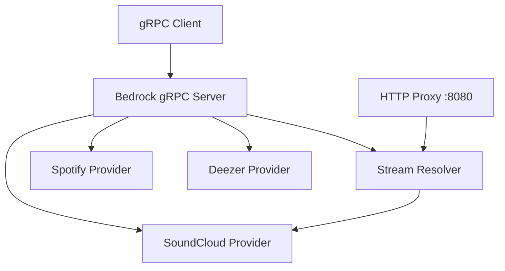

<div align="center">

<!-- Replace the source of this image with your final banner.
     Design Suggestion: A wide, high-contrast banner (1200x400) featuring
     the Bedrock logo and maybe some abstract waveforms or music-themed
     elements in a dark aesthetic. -->


# Bedrock-API

### your unified gateway to the world's music.

[](https://go.dev/)
[](LICENSE)
[](https://github.com/OWNER/REPO/stargazers)
[](https://github.com/OWNER/REPO)

> **Note:** Replace `OWNER` and `REPO` in the badge links above with your GitHub username and repository name.

[Documentation](#documentation) • [Installation](#installation) • [Telegram Channel](https://t.me/placeholder) • [Discord](#discord)

---

</div>

## What is Bedrock?

**Bedrock-API** is the engine under the hood of the Bedrock music app. It's a high-performance gRPC server that talks to multiple music platforms at once, so you don't have to.

Instead of juggling different APIs for Spotify, SoundCloud, and Deezer, Bedrock gives you one clean, normalized interface. It handles the heavy lifting—parallel searches, metadata normalization, and even "bridging" non-streamable tracks by finding playable alternatives on other platforms automatically.

Oh, and it includes a built-in **HTTP Streaming Proxy** that handles seeking and caching, so you get a smooth listening experience regardless of the source.

## Key Features

- **Multi-Provider Aggregation**: Search and fetch tracks, albums, artists, and playlists from Spotify, SoundCloud, Deezer, and more.
- **Cross-Platform Bridge**: Automatically resolve non-streamable tracks (Spotify/Deezer) to playable SoundCloud streams.
- **Built-in Streaming Proxy**: High-performance HTTP proxy with support for range requests and true `io.Copy` streaming.
- **Lyrics Integration**: Synced and plain-text lyrics via LrcLib and Genius.
- **Concurrent Performance**: Fans out requests to providers in parallel using Go's high-concurrency primitives.
- **Normalized Schema**: Unified gRPC/Protobuf models for all music entities, regardless of source.

## Tech Stack

<div align="center">


</div>

## Installation

### Prerequisites

- [Go 1.23+](https://go.dev/dl/)
- [Docker](https://www.docker.com/get-started) (optional)

### Environment Setup

Create a `.env` file in the root directory and add your provider credentials:

```env
# Spotify (needed for metadata)
SPOTIFY_CLIENT_ID=your_id
SPOTIFY_CLIENT_SECRET=your_secret

# SoundCloud (comma-separated list of client IDs for rotation)
SOUNDCLOUD_CLIENT_IDS=id1,id2
```

### Running Locally

```bash
# Install dependencies
go mod download

# Run the server
go run ./bedrock_server
```

### Running with Docker

```bash
# Build the image
docker build -t bedrock-api .

# Run the container
docker run -p 50052:50052 -p 8080:8080 --env-file .env bedrock-api
```

## Architecture

Bedrock is designed to be highly modular. Each provider (Spotify, SoundCloud, etc.) is implemented as a separate adapter that satisfies a common interface.



## Stats

<div align="center">


> Replace `YOUR_USERNAME` in the URLs above to show your actual stats.

</div>

## License

Distributed under the MIT License. See `LICENSE` for more information.

---

<div align="center">

<!-- Replace with your final footer image.
     Design Suggestion: A smaller mascot or logo (200x200) with a
     "Made with ❤️ by Bedrock Contributors" text. -->


**Bedrock-API** — The foundation of your music experience.

</div>
